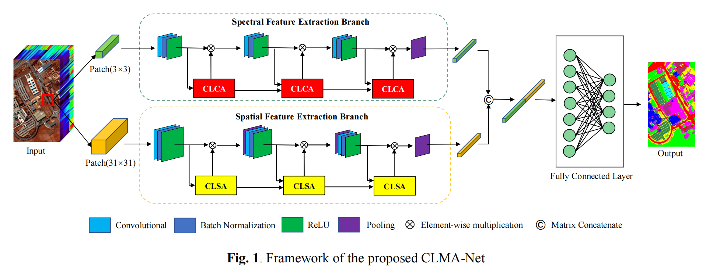

# CLMA-Net

This repository provides the code for the methods and experiments presented in our paper '**Cross-Layer Multi-Attention Guided Spectral-Spatial Classification of Hyperspectral Images**'. You can find the PDF of this paper on: https://ieeexplore.ieee.org/document/9884892



**If you have any questions, you can send me an email. My mail address is liumengkai@hnu.edu.cn.**


## Directory structure

```
path to dataset:
                ├─Data
                  ├─PaviaU
                  	├─PaviaU.mat
                  	├─PaviaU_gt.mat
                  	├─PaviaU_eachClass_20_train_1.mat
                  	├─PaviaU_eachClass_20_test_1.mat
                  	...
                  ├─salinas
                  	├─Salinas_corrected.mat
                  	├─Salinas_gt.mat
                  	├─salinas_eachClass_20_train_1.mat
                  	├─salinas_eachClass_20_test_1.mat
                  	...
                  ├─Houston
                  	├─Houston.mat
                  	├─Houston_gt.mat
                  	├─Houston_eachClass_20_train_1.mat
                    ├─Houston_eachClass_20_test_1.mat
                    ...
```

## Generate experimental samples

```
split_Dateset.py
```

## Train

```
myNet_new.py
```

## Citation

If you find this paper useful, please cite:

```
Mengkai Liu, Wei Fu and Ting Lu, "Cross-Layer Multi-Attention Guided Spectral-Spatial Classification of Hyperspectral Images," IGARSS 2022 - 2022 IEEE International Geoscience and Remote Sensing Symposium, Kuala Lumpur, Malaysia, 2022, pp. 3131-3134, doi: 10.1109/IGARSS46834.2022.9884892.
```

